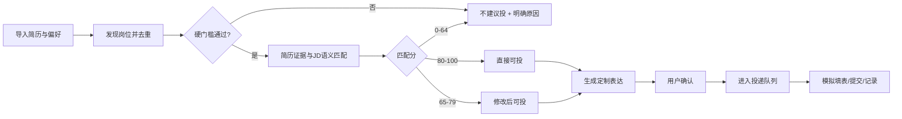
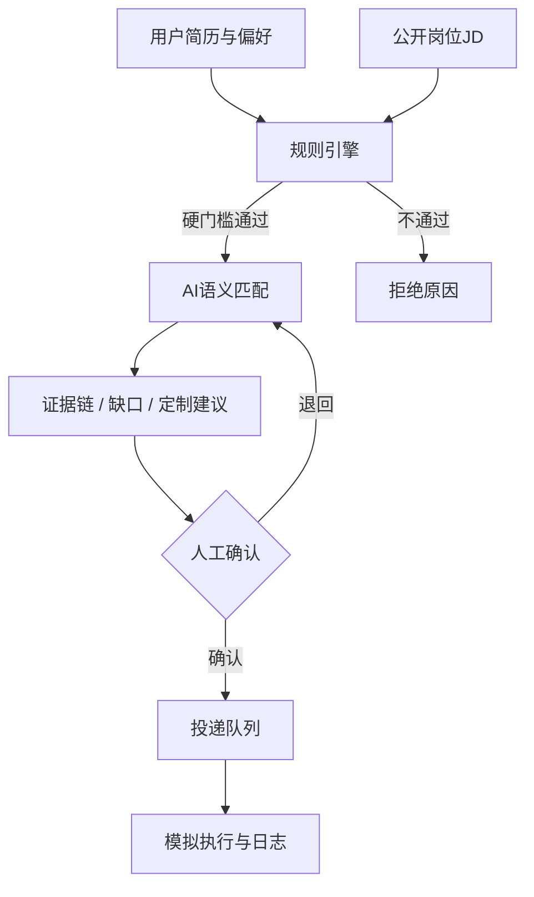

# 《职达27》真需求产品方案

> 一句话定位：为2027届财经高校管科学生，把“海量岗位”变成“有理由的投递决策”，并在用户确认后模拟执行批量投递。  
> 独立完成人：李昔伦｜西南财经大学｜管理科学与工程  
> 版本：MVP 1.0｜2026年8月2日

## 1. 执行摘要

秋招求职者并不缺岗位列表，真正缺的是三件事：硬门槛是否满足、简历证据是否对得上、被拒后下一步如何改。用户在求职高峰期每周浏览约2000个岗位、投递1500—2000份，却无法判断默拒究竟来自届别、城市、薪资、专业、到岗时间等硬条件，还是来自简历表达和岗位能力要求。

“职达27”先做判断再做自动化：

1. 从公开渠道收集真实岗位并去重；
2. 先执行届别、城市、薪资、岗位性质和实习占比等硬门槛；
3. 从简历中抽取可核验的经历证据，与岗位要求对齐；
4. 输出“直接可投、修改后可投、不建议投”及理由；
5. 只基于真实经历生成定制表达；
6. 用户确认后进入队列，Demo模拟填写、提交和进度记录。

本次使用50个公开可追溯岗位验证：26个直接可投、16个修改后可投、8个不建议投，前两类合计42/50，达到“至少40/50”的验收标准；正式岗42个、实习岗8个，实习占比16%，满足“不超过20%”。

## 2. 为什么这是一个真需求

### 2.1 高频且重复

求职高峰期每周重复搜索、筛选、改简历、填表、跟踪和测评，消耗2—3天。任务存在稳定周期，并非一次性偶发问题。

### 2.2 痛点带有真实损失

- 时间损失：大量岗位在硬门槛层面就不应投递；
- 机会损失：适合的岗位未使用合适证据表达；
- 认知损失：默拒没有解释，用户无法形成下一轮改进；
- 情绪损失：高投递量与低反馈导致持续不确定感。

### 2.3 用户存在支付意愿

用户接受求职期内月付或季付，心理价位不超过50元/月，说明问题具有可被付费解决的价值。

### 2.4 AI确实适合参与

这一任务同时包含非结构化文本理解、简历与JD语义匹配、约束判断、表达重写和批量执行。规则适合处理硬门槛，AI适合处理语义证据、差距解释和定制表达，两者结合比纯关键词搜索更合理。

## 3. 目标用户与使用场景

### 3.1 MVP用户

- 2027届财经高校本科或硕士；
- 优先管理科学与工程专业（120100）；
- 目标覆盖AI产品、产品运营、用户研究、数据分析及相邻岗位；
- 缺少清晰的岗位边界判断，希望以数据能力迁移到产品岗位；
- 秋招阶段需要高频筛选和跟踪。

### 3.2 核心场景

> 周日晚上，用户希望在30分钟内完成一批岗位的筛选：先排除硬门槛冲突，再查看最适合的岗位、定制简历表达并加入投递队列，而不是逐个打开几十个网页和重复填写表单。

### 3.3 JTBD

当我在秋招高峰期面对大量岗位时，我希望系统能告诉我“为什么值得投、为什么不该投、应该怎么改”，并在我确认后完成重复操作，从而减少无效投递并形成可复盘的求职策略。

## 4. 问题定义

### 4.1 核心问题

如何在不虚构经历、不越权操作招聘账号的前提下，用真实岗位和真实简历，在30分钟内完成一批岗位的硬门槛过滤、适配解释、定制建议和投递队列生成？

### 4.2 不解决的问题

- 不承诺提高录用概率；
- 不猜测企业未公开的筛选算法；
- 不将默拒原因包装成确定事实；
- 不替用户绕过平台规则或验证码；
- 不把实习岗位作为主推荐方向；
- 不生成虚假实习、数据或技能。

## 5. 产品目标与成功指标

| 层级 | 指标 | MVP目标 | 本次结果 |
|---|---|---:|---:|
| 北极星指标 | 真实岗位中可形成明确投递决策的比例 | ≥80% | 84%（42/50） |
| 供给结构 | 正式岗占比 | ≥80% | 84%（42/50） |
| 供给结构 | 实习岗占比 | ≤20% | 16%（8/50） |
| 可解释性 | 每个岗位给出证据、缺口和动作 | 100% | 50/50 |
| 负例能力 | 明确拒绝硬门槛冲突岗位 | ≥5个 | 8个 |
| 真实性 | 建议中虚构经历数 | 0 | 0 |
| 可运行性 | 核心Demo流程可完成 | 100% | 已通过浏览器测试 |

说明：“直接可投”指简历证据覆盖度较高，不代表录用。“薪资未披露”被标记为待人工核验，不由AI臆测。

## 6. MVP功能范围

### 6.1 P0：必须完成

| 模块 | 能力 | 用户价值 |
|---|---|---|
| 岗位发现与去重 | 汇总真实岗位、保留来源与核验日期 | 避免重复和过期信息失真 |
| 硬门槛过滤 | 届别、城市、正式岗薪资、岗位性质、实习占比 | 先排除不该投的岗位 |
| 简历证据抽取 | 教育、实习、项目、技能、量化成果 | 让匹配可追溯 |
| 匹配判断 | 直接可投、修改后可投、不建议投 | 降低决策成本 |
| 缺口解释 | 给出匹配证据、能力差距与风险 | 回答“为什么” |
| 定制建议 | 重排真实经历、补充关键词和面试准备 | 提升表达相关度 |
| 投递队列 | 用户选择或批量加入 | 聚合后续动作 |
| 模拟执行 | 模拟审阅、生成、填表、提交、记录 | 验证完整链路 |

### 6.2 P1：下一版本

- 真实岗位自动抓取与每日状态校验；
- PDF/DOCX简历自动解析与版本管理；
- AI面试题库、录音转写与可解释反馈；
- 招聘进度看板与笔试/测评提醒；
- 多用户对照实验与投递效果统计。

### 6.3 P2：暂不进入MVP

- 跨平台真实账号登录与自动提交；
- 浏览器插件绕过验证码或反自动化限制；
- 黑盒预测企业录用概率；
- 自动群发或未经确认的外部操作。

## 7. 端到端用户流程

## 8. 判断逻辑

### 8.1 第一道：硬门槛规则引擎

1. 届别：优先2027届；
2. 城市：必须至少命中11个意向城市之一；
3. 薪资：正式岗公开下限低于9000元/月则拒绝；
4. 未披露薪资：不猜测，标记“待核验”，在模拟提交前暂停；
5. 岗位性质：纯销售、前台、主播进入黑名单；
6. 到岗时间：实习需匹配8月5日、5天/周、3—6个月；
7. 供给配额：实习岗不超过岗位池20%。

### 8.2 第二道：简历—岗位匹配评分

| 维度 | 权重 | 评价内容 |
|---|---:|---|
| 岗位方向一致性 | 30 | AI产品、产品运营、用户研究、数据分析等 |
| 已有经历证据 | 25 | BMW、龙湖、新东方的任务和结果 |
| 产品与AI实践 | 20 | Agent、RAG、Prompt、PRD、用户验证 |
| 数据能力 | 15 | SQL、Python、Power BI、因果推断等 |
| 行业/场景迁移 | 10 | 电商、金融、汽车、企业服务等相关性 |

评分结论：

- 80—100：直接可投；
- 65—79：修改后可投；
- 0—64或硬门槛不通过：不建议投。

评分不是录用概率，只是“当前简历证据对岗位要求的覆盖度”。

## 9. AI在产品中的职责

### 9.1 AI负责

- 从JD中抽取职责、技能、经验、届别与风险词；
- 从简历中抽取可引用事实和量化成果；
- 将岗位要求与真实证据对齐；
- 解释匹配点、缺口与建议；
- 基于事实重组简历表达；
- 将重复申请字段映射到表单草稿。

### 9.2 规则负责

- 城市、届别、薪资、到岗时间和岗位黑名单；
- 实习岗位比例；
- 是否需要人工确认；
- 队列状态和审计日志。

### 9.3 人负责

- 确认岗位仍在招及薪资；
- 审核定制简历没有失真；
- 决定是否加入投递队列；
- 对任何真实外部提交进行最终确认。

## 10. 50个真实岗位验证

### 10.1 数据结构

- 正式岗位：42个；
- 实习岗位：8个；
- 直接可投：26个；
- 修改后可投：16个；
- 不建议投：8个；
- 推荐命中：42/50=84%。

### 10.2 来源

岗位来自百度、OPPO、字节跳动等企业校园招聘页面，拼多多和慧策牛客职位页，高校就业网公开招聘简章，以及小鹏、小红书等校园招聘页。每个岗位在Demo和岗位清单中保留来源链接。

### 10.3 负例设计

8个“不建议投”并非随机凑数，而是覆盖关键拒绝类型：

- 能力硬门槛：多模态算法、大模型算法、安全算法、测试开发、后端、数据开发；
- 岗位性质：纯机构销售；
- 城市与薪资：重庆、8—10K。

完整结果见《03-50个真实岗位匹配清单.md》。

## 11. 代表性定制策略

### 11.1 百度AI产品经理

匹配证据：BMW HR数据智能体、宠物Agent、RAG、500+用户、用户研究与PRD。  
需要补强：模型效果指标、失败案例和评测方法。  
简历动作：将Agent项目按“用户问题—方案—模型边界—指标—迭代”重写，避免只罗列工具。

### 11.2 拼多多产品管培生

匹配证据：管理科学与工程、用户洞察、SQL/Python、AI产品项目、跨团队推动。  
需要补强：业务取舍与商业化思考。  
简历动作：减少技术名词堆叠，突出需求优先级、目标和结果。

### 11.3 慧策产品运营

匹配证据：BMW流程SOP、Power BI看板、龙湖VOC、新东方增长数据。  
需要补强：ERP/WMS行业知识。  
简历动作：将BMW和新东方前置，标题改为“产品运营/数据运营”，补充产品文档和培训能力。

### 11.4 长城基金风控经理

匹配证据：绿色信贷面板研究、异常识别、数据准确率100%的流程、Python/SQL/BI。  
需要补强：基金法规和Oracle。  
简历动作：强调风险指标、数据核验与审计追溯，未掌握的工具不写入简历。

### 11.5 字节跳动评测产品经理

匹配证据：AI工作流、数据校验、量化研究。  
需要补强：系统化大模型评测集。  
简历动作：增加Golden Set设计，使用准确率、幻觉率、拒答率和任务完成率描述评测方案。

## 12. Demo设计

### 12.1 三个核心页面

1. 岗位匹配：显示50岗、筛选器、结论与匹配分；
2. 投递队列：显示已选岗位、定制状态、薪资核验和模拟日志；
3. 验收看板：显示42/50命中、正式/实习结构和8个负例。

### 12.2 关键交互

- 按关键词、岗位类型、结论和城市筛选；
- 点击岗位查看匹配证据、缺口和定制动作；
- 单个加入或一次加入42个可投岗位；
- 模拟“审阅—生成—填表—提交—记录”；
- 薪资未公开的正式岗自动停在人工核验；
- 所有岗位可打开公开来源。

### 12.3 技术实现

- 纯HTML、CSS、JavaScript；
- 无需安装依赖，可直接打开；
- 岗位数据本地静态加载；
- 不上传简历，不保存联系方式，不访问第三方账号。

## 13. 验收方案与黄金测试集

| 测试项 | 输入 | 期望输出 | 结果 |
|---|---|---|---|
| 岗位数量 | 全量数据 | 50 | 通过 |
| 正式/实习结构 | 全量数据 | 42/8 | 通过 |
| 推荐命中 | 全量数据 | ≥40 | 42，通过 |
| 实习过滤 | 选择“实习” | 8 | 通过 |
| 关键词过滤 | 输入“算法” | 3个算法岗位 | 通过 |
| 详情解释 | 点击OPPO AI产品实习 | 证据、缺口、动作完整 | 通过 |
| 批量入队 | 点击“加入42个可投岗位” | 队列数42 | 通过 |
| 薪资待核验 | 模拟执行未披露薪资正式岗 | 暂停并记录 | 通过 |
| 负例拦截 | 纯销售/硬技术/低薪异地 | 不建议投 | 通过 |
| 运行质量 | 浏览器控制台 | 无错误 | 通过 |

## 14. 风险与合规

| 风险 | 影响 | 控制措施 |
|---|---|---|
| 岗位下线或变化 | 推荐失效 | 保留核验日期和来源；提交前二次确认 |
| 未公开薪资 | 违反薪资偏好 | 不猜测，进入人工核验 |
| AI虚构经历 | 简历失真 | 事实白名单、逐条证据引用、人工确认 |
| 自动化越权 | 账号或平台风险 | MVP不登录、不真实提交、不绕验证码 |
| 匹配分被误解为录用率 | 错误决策 | 明确评分定义与免责声明 |
| 个人信息泄露 | 隐私风险 | Demo不包含电话、邮箱，不上传简历 |
| 样本偏差 | 无法外推 | 当前只验证单用户；下一阶段扩展5—20人 |

## 15. 商业模式

### 15.1 免费版

- 每周20个岗位匹配；
- 基础硬门槛过滤；
- 单份简历版本；
- 手动投递记录。

### 15.2 求职季Pro版

- 建议定价：29元/月或79元/季度；
- 50+岗位批量匹配；
- 多岗位定制建议；
- 面试复盘与进度提醒；
- 价格低于用户50元/月上限。

### 15.3 收费原则

不以“保证Offer”为卖点，不向用户出售付费内推，不隐藏招聘来源，不对未公开信息作确定承诺。

## 16. 迭代路线

| 阶段 | 周期 | 目标 |
|---|---|---|
| MVP 1.0 | 当前 | 50岗真实数据、匹配解释、队列和模拟投递 |
| MVP 1.1 | 1—2周 | 自动解析简历、岗位状态复核、简历版本管理 |
| Pilot | 3—4周 | 邀请5名同专业用户，记录决策时间和修改采纳率 |
| Beta | 5—8周 | 200+岗位、投递进度、AI面试复盘、提醒 |
| Commercial | 求职季 | 29元/月或79元/季度，验证付费转化和留存 |

## 17. 后续实验

### 实验A：解释是否降低决策时间

- 对照组：只看岗位标题和JD；
- 实验组：看硬门槛、证据、缺口和动作；
- 指标：每个岗位平均决策时间、错投率、主观确定感。

### 实验B：定制表达是否提高简历通过率

- 对照：原简历；
- 实验：只重组真实经历的定制简历；
- 指标：简历筛选通过率、笔试/面试邀请率；
- 限制：需要控制公司、岗位和投递批次差异，不能把相关性当因果。

### 实验C：用户是否愿意付费

- 展示免费版与29元/月版本；
- 指标：价格页到付费意向、实际支付、次月留存；
- 先验证价值，再扩大自动投递能力。

## 18. 最终交付

- 原始需求记录（Markdown）；
- 真需求产品方案（Markdown与Word）；
- 50个真实岗位匹配清单（Markdown）；
- 可运行网页Demo；
- 演示说明；
- 课堂汇报PPT；
- 完整交付压缩包。

## 19. 结论

本项目的核心不是“更快地海投”，而是把求职者无法解释的黑箱拆成三层：硬门槛、证据匹配和人工确认。只有前两层通过，自动化才进入队列。这样既回应了用户真实的高频痛点，也把AI的优势限制在可核验、可解释、可回滚的范围内。
