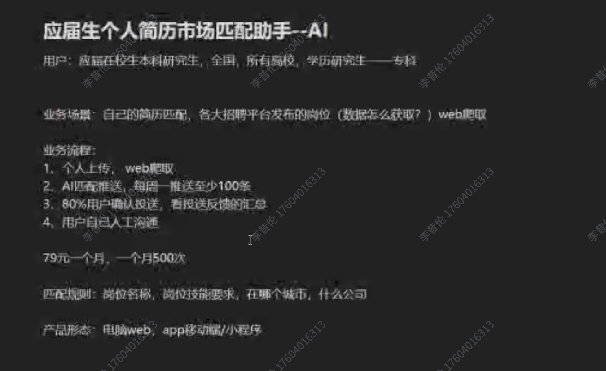
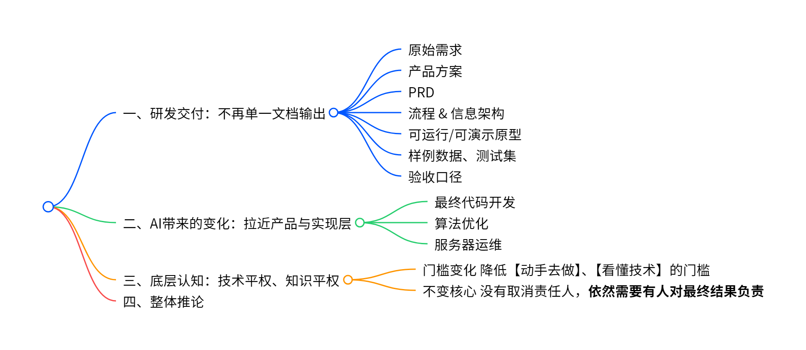

# 7\.27《如何成为AI产品经理》课堂笔记

*核心：先做好「产品经理」，再做对「AI 产品经理」*

**做一个善于思考的学习者！**

[笔记原稿\.pdf](图片和附件/笔记原稿.pdf)

# 课堂内容总结

## 目  录

**第一篇  岗位坐标与全景** 

第 1 章  PM 岗位「坐标系」

第 2 章  学习目标 

**第二篇  为什么是现在：三浪叠加**

第 3 章  三浪叠加，三个视角同时在变 

第 4 章  三浪之下，PM 的动作被改写 

**第三篇  业务属性与角色定位** 

第 5 章  产品经理的本质：业务场景 

第 6 章  从「我想要」到「交付的价值 / 不做的边界」

第 7 章  什么是真需求

第 8 章  找场景，用五个透镜

第 9 章  转化时，交出什么，踩到什么

第 10 章  传统 PM · FDE · AI PM：同一个底座的三种本事

**第四篇  职责边界与工程协作**

第 11 章  一张表，讲清交接点

第 12 章  PM 岗位职责边界：OWN / SHARE / INFORM

第 13 章  工程定位：从需求翻译官到价值负责人

第 14 章  大闭环 × 小闭环

**第五篇  AI 重构：形态、决策与指标**

第 15 章  什么是 AI PM：把智能当成关键生产要素

第 16 章  先划清：什么不是 AI PM

第 17 章  八个维度全变了，形态有五种

第 18 章  AI 产品的入口，是决策点

第 19 章  AI 在这些地方上场最稳

第 20 章  AI 产品，得能量火候：六项 AI 原生指标

**第六篇  实战案例与全景图谱**

第 21 章  案例一：B 端流程数字化，从需求转发到指标共创

第 22 章  案例二：AI 功能「假完成」——智能助手没人用

第 23 章  四站全景 × 能力图谱

第 24 章  收束：四模块映射与一句话总结

**第七篇  课程实操——需求与原型**

第 25 章 从场景出发，把模糊想法问成可执行需求

第 26 章 真需求必须经得起价值、成本与证据的检验

第 27 章 AI不是替我思考，而是把产品工作变成可并行的工作流

第 28 章 原型之后还要验证核心价值，并明确人与AI的责任边界

## 正文内容

### 第一篇  岗位坐标与全景

**第 1 章  PM 岗位「坐标系」**

**1\.1  七个维度，构成一张 PM 岗位「认知地图」**

**1\. **三浪叠加：能力浪 × 形态浪 × 角色浪 —— 为什么 PM 岗位必须被重新定义。

**2\. **业务属性：把业务问题翻译成产品方案 —— PM 的本职从未改变。

**3\. **职责边界：管什么、共担什么、不管什么 —— 协作可预期的前提。

**4\. **工程双闭环：大闭环交付价值，小闭环保方向 —— AI 时代的工程节奏。

**5\. **AI 叠加层：看见智能、定义任务、管住不确定 —— AI PM 的特有责任。

**6\. **四站全景：AI PRD · 提示 · 飞轮 · 商业 —— 把一天工作拆成四个站点。

**7\. **能力图谱：四层 × 十二项，对表自检 —— 用来给自己做体检。

|**核心原则 **「不会做业务转化，做不好 AI 产品；只会调模型，成不了产品经理。」坐标系的目的是让你判断自己当前落在哪一格、下一格该往哪里走。|
|---|

**第 2 章  学习目标**

**2\.1  产品经理要交付的，不是知识，而是判断**

**1\. **认知锚点：业务特性 × 智能设计 —— 把「AI」和「PM」拆开再装回去。

**2\. **能力阶梯：上半场讲为什么，下半场讲怎么做。

**3\. **可迁移经验：场景识别的五个透镜、指标共创、四站全景等方法可在不同业务间复用。

**2\.2  学习姿态：不抄原文，善于思考，记录问题**

个人的想法、经验、问题、收获，这才是「独属于自己的思考」。

### 第二篇  为什么是现在：三浪叠加

**第 3 章  三浪叠加，三个视角同时变化**

**3\.1  三浪是同一时间轴上的三层重写**

|**维度**|**时间段**|**关键事件**|**结果**|
|---|---|---|---|
|能力浪|2017 → 2026|2017 Transformer → 2022 ChatGPT → 2025 多模态长上下文|生产要素变了：智能可调用|
|形态浪|2023 → 2026|2023 Copilot → 2024 Agent → 2026 嵌入式智能|产品形态变了：智能有形态|
|角色浪|2025 → 2026|2025 企业级 Agent 落地 → 2026 PM 边界重写 / 软件工程协作被改写|PM 的活变了：岗位被重写|

|**名句 **「三浪不是三段，是同一时间轴上的三层重写——能力 × 形态 × 角色，一起变，单看一会误判。」|
|---|

**第 4 章  三浪之下，PM 的动作被改写**

**4\.1  原来干什么 vs\. 现在干什么**

三浪同时推着 PM 的「动作清单」改写：能力给了我们新工具，形态要求我们先选对路，角色逼我们扛起最终结果。

|**层面**|**原来干什么**|**现在干什么**|**不变的风险**|
|---|---|---|---|
|能力|需求提完等研发做|自己调 AI、先验证、再设计|是否解决实际问题|
|形态|先画 UI 再塞 AI|先选形态、再画页面|形态错配没人用|
|角色|上线即给结论|对业务结果负责|「上线 = 成功」被重估|

|**岗位冲击 **能力浪：技术平权，机会窗口变短。形态浪：形态错配没人用。角色浪：交付、决策、标准重写。|
|---|

### 第三篇  业务属性与角色定位

*无论叫不叫「AI」，产品经理的本质始终是「业务场景 × 约束 → 产品方案 → 可度量结果」。*

**第 5 章  产品经理的本质：业务场景**

**5\.1  PM 的四重属性**

产品经理不是「提需求的人」，而是把模糊业务诉求转化成可开发、可验收、可衡量方案的人。四重属性环环相扣：

|**属性**|**含义**|**关键词**|
|---|---|---|
|问题本质|对「真问题」负责，不对提需人的「原话」负责|真问题 / 反传说 / 挖根因|
|价值属性|一头连用户价值，一头连商业价值|用户价值 / 商业价值 / 双价值|
|转化翻译|把模糊诉求变成能开发、能验收的方案|可开发 / 可验收 / 反模糊|
|结果属性|使用 \+ 效果 \+ 代价三件齐备 = 「真的发生了」|使用 / 效果 / 代价|

|**定义 **业务问题 × 约束 → 产品方案 → 可度量结果。这是 PM 在「业务面」上的统一表达。|
|---|

**第 6 章  从「我想要」到「交付的价值 / 不做的边界」**

**6\.1  把诉求翻译成承诺**

AI 时代的产品不能再用「我想要……」来定义，而要回答三件事：

**1\. **我承诺「交付的价值」：明确这个东西干什么用、能产生什么效果。

**2\. **我明确「不做的边界」：哪些事我们不做、不值得做、不应该用 AI 做。

**3\. **我验收「衡量的指标」：使用、效果、代价三件齐备才算真的发生。

**6\.2  转化的完整链路**

链路：「业务诉求 → 问题定义 → 价值假设 → 方案策略 → 产品化表达 → 验收指标 → 验证迭代」。

共三块：问题定义与价值假设；方案策略与产品化；验收与验证迭代。任何一块缺失都会让产品不可信。

|**模块入口 **「从这个模块开始」，以前是「我要一个产品」，现在是「我承诺交付什么价值、明确不做什么」。|
|---|

**第 7 章  什么是真需求**

**要目标，不要嘴上的方案**

真需求有四条判定标准，缺一不可：

**1\. **场景真实：有具体的人、具体的事，不是拍脑袋的假设。

**2\. **痛且高频：反复受苦、经常发生，不是偶尔想起。

**3\. **愿付代价：肯花时间、花钱、改习惯，嘴上要的不算。

**4\. **独立于方案：换个功能它还在，指向目标不指向做法。

|**判定反模式 **「嘴上方案」常见表现：「领导要 AI」、「对标竞品」、「做大屏」。这三种都不构成真需求，因为它们指向的是做法而不是目标。|
|---|

举例：员工天天花两小时做 Excel 报表，他愿花 1 个月时间忍受上线阵痛，换来以后每天 1 分钟自动出表——这才是真需求。

**第 8 章  找场景，用五个透镜**

**业务场景发掘的「反模式」清单**

五种借口：「竞品抄」、「模型流」、「把老板 PPT 关键词当场景」、「技术新鲜」、「领导感兴趣」。它们都不是场景，是借口。真正的场景要过五透镜：

|**透镜**|**权重**|**关键问题**|
|---|---|---|
|痛点 / 损失|20%|这件事不做会怎样：投诉、工单、加班、差错。|
|决策点|10%|这件事由人拍板：审批、分诊、匹配、质检。|
|频次 × 影响|40%|天天要做还是一年一次；频次是首要权重。|
|现状替代|10%|已经在用 Excel、群、人硬扛，说明有需求。|
|数据可触达|20%|没有数据，产品化就难。|

|**核心原则 **真场景 = 高频 × 可触达 × 可闭环。权重最大的频次×影响，决定要不要做。|
|---|

**第 9 章  转化时，交出什么，踩到什么**

**9\.1  业务原话 → 产品语言，逐句翻译**

需求转化的关键是把「业务原话」翻成「开发能理解、用户能验证」的句子。

|**业务原话**|**未转化（坑）**|**已转化（产物）**|
|---|---|---|
|「我们要智能化」|上 AI 模型|哪个任务自动化到什么程度，用 AI 原生指标量化|
|「对标竞品 A」|抄功能|我们要赢的那个用户任务是什么，有什么价值|
|「领导要大屏」|做大屏|谁用、做什么决策、看完下一步干什么|

**9\.2  三个阶段踩到的坑**

**1\. **定义与假设阶段：坑在「方案误写成问题」（问题陈述\+指标草案 vs 方案误写成问题）。

**2\. **策略与产品化阶段：坑在「一口吃成胖子」（MVP 边界\+流程规则 vs 一口吃成胖子）。

**3\. **验收与验证阶段：坑在「上线即结项」（数据口径\+复盘 vs 验收=点页面\+上线即结项）。

|**心法 **「转化起点永远是业务问题；AI 时代多输出两个产物——① 不确定性的边界 ② 评测机制。」|
|---|

**第 10 章  传统 PM · FDE · AI PM：同一个底座的三种本事**

**同一个 PM 底座，各自多出来的本事**

三者不是替代关系，而是同一能力的不同侧重：传统 PM 强调系统优化，FDE 强调驻场落地，AI PM 强调把智能当作生产要素。

|**传统 PM · 底座**|**FDE · 突出**|**AI PM · 突出**|
|---|---|---|
|发现并定义真问题|驻场跟真流程|把模型当生产要素|
|优先级与取舍|代码手写原型|定义任务 · 划边界|
|把需求翻译成方案|边做边挖逼真问题|管不确定 · 做评测|
|推动交付、担责|短周期快速证伪|沉淀可复制产品|
|PRD · 原型 · 用例|现场跑通的原型|任务定义\+指标|

|**岗位定位 **「FDE 溢出真问题，AI PM 沉淀产品，一快一稳，最好并肩。」AI PM 是 PM 能力的全面拔高，而不是舍弃传统功夫。|
|---|

### 第四篇  职责边界与工程协作

*越界、缺位、伪负责，是 PM 协作的三种慢性病。明确边界，才能让协作可预期。*

**第 11 章  一张表，讲清交接点**

**越界、缺位、伪负责：PM 协作的三大慢性病**

PM 永远在交涉和被交涉。这张表把每一条交接线画清楚，让协作可预期：

|**PM 交给对方**|**对方交给 PM**|**一起拍板**|
|---|---|---|
|业务/运营：问题定义、方案、节奏|场景真相、资源、推广|做不做、成功标准|
|设计：任务流、约束、优先级|交互与信息架构方案|体验取舍|
|研发：范围、规则、验收、依赖|可行性、工期、技术风险|MVP 砍什么|
|测试：验收标准、关键路径|质量风险、缺陷优先级|能不能上线|
|数据/算法：任务、效果、边界|能力边界、评测建议|效果门槛|
|合规/安全：场景与数据说明|红线与整改要求|风险能不能接受|

|**协作三病 **越界：替人派活，背锅算不清。缺位：没人拍板，项目空转。伪负责：不签字，决策悬空。|
|---|

|**金句 **「我全都要」更像负责人——越界（替人派活）、缺位（推诿）、伪负责（挑水不喝），是 PM 协作的三种慢性病。|
|---|

**第 12 章  PM 岗位职责边界**

**12\.1  OWN / SHARE / INFORM：一张 OWNERSHIP MAP**

OWNERSHIP MAP 不是画地为牢，是让人知道找谁，让协作可预期。它分三层：

|**层级**|**主责清单**|**主责本质**|**协作方**|
|---|---|---|---|
|必须主责 OWN|问题定义与范围 / 优先级与取舍 / 体验效果目标 / 上线决策建议|决策权 / 交付物 / 最终责任 / 协作可预期|—|
|强协作 · 共担 SHARE|方案可行性 / 工期质量平衡 / 数据口径共建 / 风险评审|共担|设计、研发、测试、数据/算法|
|知情 · 不主责 INFORM|代码实现细节、服务器运维、薪酬劳动合同、算法论文级优化|知情|法务、财务、战略、基础设施|

**12\.2  AI 时代的加粗线**

**1\. **效果门槛：以前只看功能，现在必须看概率与召回。

**2\. **人机边界：哪些交给 AI、哪些保留给人。

**3\. **成本阈值：每一次调用的钱与算力。

**4\. **坏例阻断：上线前必须把典型坏例堵住。

**第 13 章  工程定位：从需求翻译官到价值负责人**

**以前的 PM vs\. 现在的 AI PM**

「以前」是 PM 接到业务提单，再翻译成 PRD/原型交给研发。「现在」是 PM 直接对结果负责，链路里多了任务定义、人机边界、效果评测、闭环回流。

|**定位**|**以前常见**|**现在真实**|
|---|---|---|
|定位|需求翻译官 / 接单员|价值负责人 / 对结果负责|
|产出|PRD \+ 原型 \+ 上线|可验证度量 \+ 指标|
|决策点|上线 = 完事|可验证价值发生|

|**金句 **「以前把需求讲清楚让人做；现在把价值做出来，还得证明它发生了。」|
|---|

**第 14 章  大闭环 × 小闭环**

**AI 没取消小闭环，只是往里塞了不确定和评测**

大闭环仍是软件工程：发现与策略 → 需求与方案 → 设计与构建 → 发布、运营、学习。它保证价值持续交付，反馈到投资决策。

小闭环是 PM 主场：洞察与诉求 → 问题定义 → 方案范围与对齐 → 验收、数据复盘。它保证「做对的事」再进入大闭环。

|**二者关系**|**AI 改写双闭环**|
|---|---|
|不承包大闭环|入口加能力边界|
|对小闭环质量负责|验收扩到效果风险|
|节点上决策对齐|运营段权重上升|
|小闭环喂大闭环|发布加成本安全围栏|

|**同心圆 **大闭环保交付，小闭环保方向。AI 把小闭环塞进了「不确定 \+ 评测」，验收从「能用」扩到「能用 \+ 有效 \+ 不出格 \+ 花得起」。|
|---|

### 第五篇  AI 重构：形态、决策与指标

*AI 不是「加一个功能」，而是把生产要素、形态选择和度量体系全部改写。*

**第 15 章  什么是 AI PM：把智能当成关键生产要素**

**AI PM 的内核定义**

AI PM 是「可定义、可交互、可评测、可运营、可迭代」的产品系统设计者，对业务结果负责。

**1\. **可定义：把智能拆成可定义的任务、人机边界、原型、流程。

**2\. **可评测：把「能不能用」拆成「能不能赢」的指标。

**3\. **可运营：上线后能持续被用、被反馈、被迭代。

**4\. **可复制：把智能当作生产要素，少一个就从「能 demo」滑向「不能用」。

|**一句话 **「少一环就从『能 demo』滑向『不能用』。」AI PM 的工作不是炫技，而是让智能真的能被业务用起来。|
|---|

**第 16 章  先划清：什么不是 AI PM**

**Prompt、算法、API、按钮——都只是工具/技能**

AI PM 容易和「会写 Prompt」「懂算法」「能调 API」「会点按钮」混在一起。但这些都是技能，不是岗位：

|**传统 PM**|**AI PM**|
|---|---|
|确定的系统优化者（CLASSIC）|不确定的系统设计者（NEW ERA）|
|交付物：PRD / 原型 / 用例|交付物：任务定义 / 人机策略 / 评测基线 / 坏例闭环|
|决策权：优先级 / 范围 / 体验|决策权：自动化边界 / 风险成本阈值 / 任务成功 / 安全 / 单位成本|
|成功：上线 / 采用 / 满意度|成功：任务成功 / 安全 / 单位成本|

|**交叉地带 **「重点管任务与效果；要懂但不深潜训练与算力。」AI PM 关注系统有效性，不必亲自写 CUDA。|
|---|

**第 17 章  八个维度全变了，形态有五种**

**八维 × 五形态：新的产品版图**

八个维度同时在变：对象、需求、确定性、验收、迭代、成本、风险、协作。它们组合出五种产品形态：

|**形态**|**英文**|**特征**|
|---|---|---|
|对话形态|Chat|通用问答与内容生成入口|
|副驾形态|Copilot|嵌入流程的人机并肩协作|
|自主形态|Agent|自主规划执行多步任务|
|协同形态|Multi\-Agent|多智能体分工协同网络|
|无形形态|嵌入式智能|能力融进业务每个角落|

|**总判断 **「传统 PM 优化确定系统；AI PM 设计不确定系统。形态是战略不是炫技。」五形态按自动化程度递增。|
|---|

**第 18 章  AI 产品的入口，是决策点**

**入口一变、形态二变、验收三变、迭代四变**

AI 产品的入口和传统产品不同——传统靠功能，AI 靠决策点：「用户任务 × 不确定性」。没有业务闭环就没有 AI 入口。

|**维度**|**原方式**|**新方式**|
|---|---|---|
|入口|决策点（用户任务 × 不确定性）|没有业务闭环就没有 AI 入口|
|一变|确定性输出 → 概率性输出|输出概率化，需要可控：设计对象从「逻辑链」变成「概率分布」|
|二变|功能验收 → 效果验收|验收扩展到效果与评测|
|三变|版本迭代 → 能力迭代|闭环与数据驱动进化|

|**金句 **「Jobs\-To\-Be\-Done（JTBD）：功能是结果，决策点才是 AI 产品入口。」|
|---|

**第 19 章  AI 在这些地方上场最稳**

**19\.1  25 年黑松客项目里，AI 最能赢的前几种姿势**

AI 不是万能的。挑对场景，AI 才是加分项；挑错场景，AI 就是减分项。2025 年最稳的几类场景：

|**门类**|**判断要点**|
|---|---|
|规则清晰|规则越清楚，越适合交给 AI|
|数据充足|有数据，才有可评测的能力|
|重复高频|高频重复，收量最容易放大|
|度量简单|成败可量化，才能持续优化|

**19\.2  五种「加分姿势」**

**1\. **标准规则 \+ 大量时间：审批初化、合规初核、工单分诊。

**2\. **AI 作为翻译层：系统对接、数据查询、自然语言报表。

**3\. **一次性事件 → 持续提醒：工单跟进、风险监控、异常告警。

**4\. **「领域专家」自己做智能体：法务/HR/财务问答、内部知识库。

**5\. **嵌入式协同：把能力融进机器狗、智能终端等业务角落。

|**结语 **「边界不是限制，是副本；挑对场景，AI 才是加分项。」|
|---|

**第 20 章  AI 产品，得能量火候**

**六项 AI 原生指标速查**

一个 AI 产品与一个「用了 AI 的传统产品」的本质差别在指标。DAU、转化率、留存率是温度计，火候另有六把尺：

|**指标**|**量什么**|**AI 原生写法**|
|---|---|---|
|幻觉率|模型编造事实的比例|幻觉率从 X% 降至 Y%|
|召回率 / 准确率|检索/回答的正确程度|问答准确率从 X% 升至 Y%|
|单次调用成本|每次请求花多少钱|单次成本从 X 元优化到 Y 元|
|人工接管率|多少比例需要人介入|人工接管率从 X% 降至 Y%|
|首 Token 延迟|用户多久看到第一个字|首 Token 延迟从 X 秒优化到 Y 秒|
|Token 消耗|每次交互的 Token 用量|Prompt 压缩后 Token 消耗降低 X%|

|**金句 **「只会用温度计，不知道什么叫火候。」AI PM 设量火候，只量温度，等于会做饭的人不知道什么叫火候。|
|---|

### 第六篇  实战案例与全景图谱

*两则真实案例，一张能力图谱，把今天的所有概念拉回到地面。*

**第 21 章  案例一：B 端流程数字化，从需求转发到指标共创**

**21\.1  业务方天天提加字段、加审批、导 Excel**

这是 B 端流程数字化里最常见的 PM 困境：业务天天提加字段、加审批、导 Excel；版本发了一堆，业务到底好不好却说不清。PM 长期只做需求转发，指标驱动缺位。

|**指标**|**过去**|**现在**|
|---|---|---|
|条/迭代|30 条|1 条指标|
|闭环|过去业务录单|现在锁定业务结果|
|大小闭环|—|首次同转|

**21\.2  三个「后半段活了」**

**1\. **起点换了：小闭环从「接单据」改成「追指标」。

**2\. **角色回位：PM 从跟单员，回到价值负责人。

**3\. **后半段活了：大闭环运营与学习第一次真正转起来。

|**金句 **「指标驱动 vs 需求清单」——这个案例是 P11 的「现在版」，三件事一起变：起点（小闭环）、角色（PM）、后半段（大闭环）。|
|---|

**第 22 章  案例二：AI 功能「假完成」——智能助手没人用**

**22\.1  两个冲刺，立项时业务决策点 = 0**

这是反面案例：接模型宣布转型，立项时业务决策点 = 0；研发两周挂个对话框上线，演示很惊艳，生产很冷清。小闭环没有验收，大闭环没有发布。

|**问题**|**根因**|
|---|---|
|2 个冲刺|接模型即宣布转型|
|0 个决策点|立项时业务决策点缺失|
|5 段信号逐级失真|①业务方模糊愿景 ②决策者拍板挂上 AI ③研发两周接模型\+对话框 ④上线发布 ⑤一线没人用|

**22\.2  现在要守双闭环，假完成更易发生**

**1\. **以前定位失灵：只说「需求已开发」，解释不了为什么失败。

**2\. **现在要守双闭环：小闭环保验收，大闭环保运营学习。

**3\. **假完成更易发生：更容易发生，也更容易被数据拆穿。

|**金句 **「没有评测、没有回流的上线，只是一次公开 Demo。」|
|---|

**第 23 章  四站全景 × 能力图谱**

**23\.1  四站：AI PRD · 提示 · 飞轮 · 商业**

把一天工作拆成四个站点，是 AI PM 的全景作业图：

|**站点**|**产物**|**关键问题**|
|---|---|---|
|AI PRD|任务定义 · 人机边界 · 上下文/工具/权限|任务是什么，边界在哪|
|提示|效果与样板意识|AI 怎么答得稳、答得对|
|飞轮|评测闭环 · 能力迭代|数据怎么驱动产品进化|
|商业|商业可行性 · 价值与商业化|能不能挣到钱，单位成本多少|

**23\.2  四层 × 12 项能力（CAPS）**

|**层级**|**能力项**|
|---|---|
|L0 座底业务与推进|场景与任务洞察 / 优先级与取舍 / 跨职能能推进|
|L1 智能设计|任务建模 / 形态与人机边界 / 上下文·工具·权限|
|L2 评测运营|效果定义 / 评测与坏例意识 / 成本与体验经营|
|L3 组织商业|跨角色协作 / 风险与合规 / 价值与商业化|

|**自检短版 **下午场站展开——「四站加起来才是 AI 时代 PM 的护城河」。|
|---|

**第 24 章  收束：四模块映射与一句话总结**

**24\.1  对不准？回到对应模块再看一眼**

一张映射表，把今天串回去：

|**模块**|**对应页码**|**核心内容**|
|---|---|---|
|01 业务底座|P5–P8|真需求 · 五透镜 · 转化链路 · 产物与坑|
|02 边界与工程|P9–P14|职责边界 · 交付结果价值 · 双闭环|
|03 AI 重构|P15–P20|AI PM 四动作 · 三要素 · 八维 × 五形态|
|04 全景图谱|P21–P22|四站全景 · 12 项能力 · 自检短版|

**24\.2  带走四条「带定脚」**

**1\. **三浪不是三段，是同一时间轴上的三层重写。

**2\. **把智能当关键生产要素，设计对象从「逻辑链」变成「概率分布」。

**3\. **不会做业务转化、做不好 AI 产品；只会调模型，成不了产品经理。

**4\. **没有评测、没有回流的上线，只是一次公开 Demo。

|**一句话总结 **AI 产品经理的护城河，不是模型本身，而是「业务 × 智能 × 工程 × 商业」四站连续跑通的闭环。|
|---|

### 第七篇  **课程实操——需求与原型**

***使用工具：Orca、Codex\(ChatGPT\)、Claude Code、Notepad、Pixso***

**第 25 章  从场景出发，把模糊想法问成可执行需求**

下午的实操没有停留在概念解释，而是**从同学提出的“简历与岗位自动匹配、辅助投递”切入，现场走了一遍产品从零到一的过程**。小程序、App、网页都只是技术形态，“做一个小程序”或“做一个雷霆战机”还不能称为产品。产品必须先回答：为谁服务、解决什么问题、在什么情境下使用，以及解决之后能产生什么价值。

老师把原本宽泛的想法不断追问具体：目标用户是应届本科生、研究生还是更广的人群？简历从哪里获得？岗位信息来自招聘平台接口、公开网页还是学校渠道？匹配依据是岗位名称、技能要求、城市与公司，还是更深层的语义相似度？系统每周推送多少条，用户会筛选多少条，投递后怎样汇总反馈？这些问题让我看到，**需求分析并不是替用户重复愿望，而是把“想要一个自动化工具”拆成用户、数据、规则、流程和结果。**

具体的产品初步方案如下：

这也改变了我对“倾听用户”的理解：倾听不是全盘照收，而是确认**角色、输入、动作、输出与例外**，再判断哪些是必须解决的核心问题，哪些只是用户先想到的解决办法。产品形态应当在需求清楚以后决定。

**第 26 章  真需求必须经得起价值、成本与证据的检验**

需求被说清楚后，还不能马上进入设计。老师继续追问**使用频率、预期命中率和付费意愿**，并让同学直接给出价格。这个过程让我理解了“量化”的作用：如果用户希望系统每周抓取、分析并推荐大量岗位，却只愿意支付很低的费用，数据获取、模型调用和维护成本就可能无法形成闭环。**用户口头说“很需要”，不等于愿意为结果承担成本；**不过，付费意愿低也不必立刻等同于伪需求，还可能说明付费者不是学生本人，或产品需要改成按次、按条、校企合作等模式。

老师随后用AI搜索公开资料，生成用户画像、市场判断和MVP（最小可行化产品）推送岗位建议，但没有直接相信报告中的比例和结论。他会追问数据来自哪里、平台发布的数据是否带有立场、研究生求职主渠道是否真如报告所说。这提醒我：AI调研能快速扩大信息面，却不能替产品经理完成证据审查。**产品经理需要区分事实、推断和未经验证的数字，并通过访谈、问卷或小规模实验交叉验证。**

*图片：部分用户深度研究报告截图*

我还学到，判断真需求不能只看一句“愿不愿意付费”，还要结合发生频率、问题紧迫度、现有替代方案、完成任务所耗时间以及结果价值。价格问题本质上也是产品价值、服务成本与目标人群承受力之间的匹配问题。

**第 27 章  AI不是替我思考，而是把产品工作变成可并行的工作流**

实操中，老师把项目放在独立目录中，让多个Agent结合不同Skill协同工作：有的负责联网检索和用户研究，有的持续质询需求边界，有的整理方案、PRD与信息架构，有的依据设计系统生成移动端界面和HTML原型。完整链路大致是：**原始需求—市场与用户研究—用户画像—需求质询—MVP取舍—功能清单—信息架构—设计规范—界面原型—真实数据验证。**相比单次聊天，这种方式更像在管理一组能够并行工作的数字同事。

我注意到，AI会主动指出“目标人群过宽、渠道假设不成立、定价与成本不匹配”等边界问题，也会不断要求人作出选择。真正决定产品方向的仍然是产品经理：哪些信息可信、哪些功能先做、哪些约束必须保留、生成结果是否符合真实使用。AI擅长搜索、拆解、生成和快速迭代，人则负责目标、取舍、审美、风险与最终责任。

项目目录和结构化文档在这里很重要，它们让不同Agent共享上下文，也让每一步产出能够继续被后续任务读取。工具不必求多，应按任务选模型：长文本处理、联网研究、界面生成和代码原型需要的能力并不相同。

**第 28 章 **原型之后还要验证核心价值，并明确人与AI的责任边界

老师强调，界面“看起来能用”并不代表产品成立。以岗位匹配助手为例，真正要验证的是：真实简历与真实岗位能否被稳定匹配，推荐100条时用户如何浏览、筛选和回看，加载速度与投递反馈是否可接受。AI产品还需要准备样例数据、测试用例和“黄金测试集”，先由人给出较可靠的匹配判断，再用它评估模型结果。可评估、可复现，才是把AI能力变成产品能力的关键。

对研发的交付也不再只有一份文档。产品经理应交付原始需求、产品方案、PRD、流程与信息架构、可运行或可演示的原型，以及样例数据、测试集和验收口径。AI能让产品经理更靠近实现，但岗位边界仍然存在：产品经理不负责最终代码、算法优化和服务器运维，却要理解核心AI概念，并能运用搜索、分析、原型和验证工具。老师所说的“技术平权、知识平权”，降低的是“做”和“懂”的门槛，并没有取消对结果负责的人。

*图片：产品经理交付产品思考逻辑图*

因此，快速生成页面只能缩短沟通链路，不能代替工程质量。性能、稳定性、安全性和长期维护仍需研发负责；产品经理则要保证目标正确、验收标准明确，并对用户是否真正获得价值持续追踪。

我的复盘与行动：以后遇到一个想法，我先写清用户、场景、痛点、数据、核心流程和成功指标，再用AI完成调研与原型，最后用真实样本验证。成为AI产品经理，重要的不是背工具清单，而是保持快速学习、多线程推进、业务探索、审美判断和持续质疑的能力。

# **我是怎么去思考的**

**核心结论****  **前六篇讨论的不是某个 AI 工具怎么用，而是产品经理的工作边界如何被重写：从交付文档，转向识别真问题、快速验证、建立评测闭环并对业务结果负责。

## **1\.核心命题：先做好产品经理，再做好 AI 产品经理**

我的思路起点：AI 产品经理首先仍然是产品经理。门槛不是工具数量，而是理解用户痛点、判断需求价值，并把问题拆成可验证、可交付的产品路径。

- **真问题优先。**先判断用户为什么痛、问题是否值得解决，再讨论模型、Agent 或工具选型；否则技术只会放大错误方向。

- **工具与 Prompt 都是杠杆。**对 Copilot、Coze、Dify、OpenClaw 等工具的探索，最终要落到能否把目标、上下文、约束和验收标准组织成 AI 可执行的任务。

- **价值判断必须完整。**产品不能只看“能不能做”，还要同时考虑性能、质量、成本、时间、交付周期与市场价值。

## **2\.角色升级：从写 PRD 到端到端结果负责**

传统 PM 与 AI PM 做了对照：过去的典型产出是找问题、定义问题、写 PRD，再由团队接力；现在则逐步覆盖业务理解、原型、技术沟通、评测、上线与运营。

## **3\.FDE / AI PM,而这有什么不同？我的启发**

我特别关注 FDE（前线部署工程师）与 AI PM 的重叠：靠近真实场景、快速做出可讨论的原型，并在用户与技术之间翻译。AI PM 还要进一步承担取舍、优先级与商业闭环。

- **从“我想要某功能”翻译成“用户真正要完成什么”。**继续追问场景、约束、频率、代价与成功标准。

- **从“展示能力”转向“交付系统”。**原型和 Demo 只是验证手段；只有与业务流程、数据、评测和责任机制结合，AI 才从玩具变成系统。

- **从局部提效转向整体优化。**要找出业务链条中 AI 最有价值的环节，而不是在每个环节平均用力，也不能只凭“有数据”就判断值得自动化。

## 4\.AI 原生产品的判断标准

你正在形成一套比“有没有 AI 功能”更严格的标准：目标与步骤可描述，任务可拆解，并能根据反馈持续调整。产品能力由此呈现四层递进：

- **业务与功能底座。**理解行业、场景和真实工作流，知道问题为什么存在。

- **产品与系统设计。**把能力组织成稳定的流程、界面、权限和协作关系。

- **迭代、评测与案例。**通过样本、指标和真实使用反复验证，而不是凭一次演示下结论。

- **动作与落地。**把模型输出接入后续动作，考虑成本、风险、责任和持续运营。

## 5\.几条逐渐清晰的产品原则

- **没有评测与闭环的上线，只是一次公开 Demo。**评测应成为产品本身的一部分。

- **把智能视为关键生产要素。**需要先把经验、规则、数据、角色与结果建模清楚；同时承认输出带有概率和波动，并设计容错、复核与升级路径。

- **变化不是分阶段替换，而是在同一时间轴上叠加。**工具、岗位与组织方式会同时演化。

## 6\.Multi\-Agent 与“一人公司”：组织方式的下一步

视角扩展到组织：Multi\-Agent 把复杂任务拆成明确职责，分担研究、生成、验证与执行；“一人公司”则用方法论、模型和外部信息放大个人交付能力。

潜在优势

**能力杠杆。**成熟方法论与大模型结合，使个人能够覆盖过去需要多角色协作的部分工作。

**研究与分工更灵活。**外部信息更快进入研究，Agent 也可围绕任务临时组合，让产出与复核形成短循环。

主要风险

**上下文是否真的被理解。**Agent 可能完成了表面任务，却没有理解用户、组织和场景中的隐性约束。

**责任与质量不能外包。**最终判断与风险仍集中在人；关键决策和复核若都汇聚到一个人，个人就会成为规模化瓶颈。

## 7\.仍待验证的关键问题

这些问题可以直接成为下一阶段学习、访谈或产品实验的清单：

**哪些“两小时任务”值得优先被 AI 重构？**看重复度、价值、可评测性与出错代价，而不只看能否自动化。

**为什么大量实践停留在 Chat 与 Copilot 之间？**缺口可能在场景定义、流程接入、数据条件和评测体系。

**如何衡量 AI 生产力？**把效率、质量、成本和业务结果放进同一套指标，而不只计算节省时间。

**AI PM 与一人公司的边界在哪里？**可以横跨更多环节，但不能替代战略、资源、外部协作与责任机制。

|****我的思考，正在从“学习 AI 工具”转向“建立 AI 原生的产品判断与组织方法”： **以真问题为起点，以系统交付为目标，以评测闭环为底线。**|
|---|

## 8\.第七篇实践，我最可能提出的问题汇总

1\.初始版方案是否应只服务一个更窄的人群，以换取更准确的匹配？“每周100条”究竟是用户价值，还是新的信息负担？如果用户最终只愿意投递少量岗位，产品是不是应该追求推荐质量，而不是推荐数量？

2\.招聘平台没有开放接口时，公开网页数据的采集是否合规、是否稳定？应该先验证岗位数据能不能持续获得，还是先验证用户是否愿意付费？当调研结论与现场用户经验冲突时，应当怎样设计最小成本的验证实验？

3\.多个Agent同时生成内容时，怎样保持同一份需求基线，避免版本冲突？如果HTML原型已经能够展示交互，PRD应该删减还是转向记录规则、异常状态和验收标准？设计系统应由AI临时生成，还是先由团队确定品牌和组件规范后再让AI执行？

